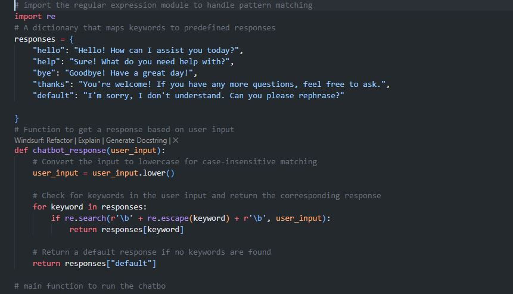
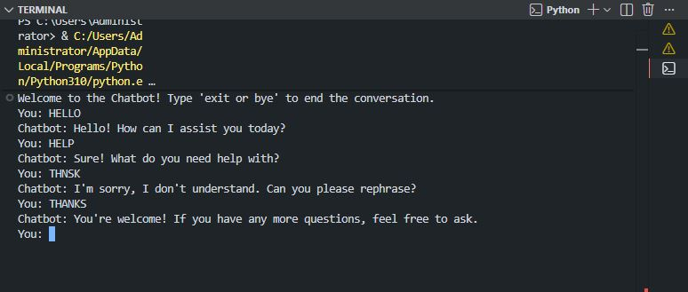

# 💬 Simple Rule-Based Chatbot | Keyword Matching Bot 🤖  
    

<p align="center">
  
</p>

🚀 A lightweight **rule‑based chatbot** implemented in Python that uses **keyword matching** and **regular expressions** to respond to user inputs. It recognises greetings, help requests, thanks, and farewells – a perfect starting point for understanding natural language processing fundamentals.

---

## ✨ Key Features  
🗣️ **Keyword Recognition** – Detects words like “hello”, “help”, “thanks”, “bye”  
🔍 **Regular Expression Matching** – Uses `re` for precise whole‑word matching  
📚 **Extensible Dictionary** – Easily add new keywords and responses  
💬 **Interactive Console** – Simple chat loop with exit command  
🧪 **Case‑Insensitive** – Converts input to lowercase for robust matching  

---

## 🧠 Tech Stack  
- **Language:** Python 🐍  
- **Library:** `re` (Regular Expressions) 🔍  
- **Architecture:** Rule‑based / Pattern matching  

---

## 📦 Installation  

```bash
git clone https://github.com/SayabArshad/Simple-Rule-Based-Chatbot.git
cd Simple-Rule-Based-Chatbot
````
No external dependencies required – only Python standard library.

---

## ▶️ Usage

Run the chatbot:

```bash
python Chatbot.py

```
Type your messages and see the bot respond. Type exit to end the conversation.

---

## 📁 Project Structure

```
Simple-Rule-Based-Chatbot/
│-- Chatbot.py           # Main chatbot script
│-- README.md            # Documentation
│-- assets/              # Images for README
│    ├── CODE.JPG
│    └── OUTPUT.JPG
```
---

## 🖼️ Interface Previews

| 📝 Code Snippet | 📊 Console Output |
|:---------------:|:-----------------:|
|  |  |

---

## 💡 About the Project

This project demonstrates a simple yet effective rule‑based chatbot that simulates a conversation by matching keywords in user input. It uses a dictionary of responses and the re module to perform whole‑word, case‑insensitive matching. The chatbot can recognise greetings (“hello”), requests for help, expressions of gratitude, and farewells. It’s an excellent educational tool for beginners to learn about text processing and building interactive programs.

---

## 🧑‍💻 Author

**Developed by:** [Sayab Arshad Soduzai](https://github.com/SayabArshad) 👨‍💻

📅 **Version:** 1.0.0

📜 **License:** MIT License

---

## ⭐ Contributions

Contributions are welcome! Fork the repository, open issues, or submit pull requests to enhance functionality (e.g., adding more keywords, using synonyms, or integrating a simple GUI).
If you find this project helpful, please ⭐ star the repository to show your support.

---

## 📧 Contact

For queries, collaborations, or feedback, reach out at **[sayabarshad789@gmail.com](mailto:sayabarshad789@gmail.com)**


---

💬 Building conversational AI, one rule at a time.

---
